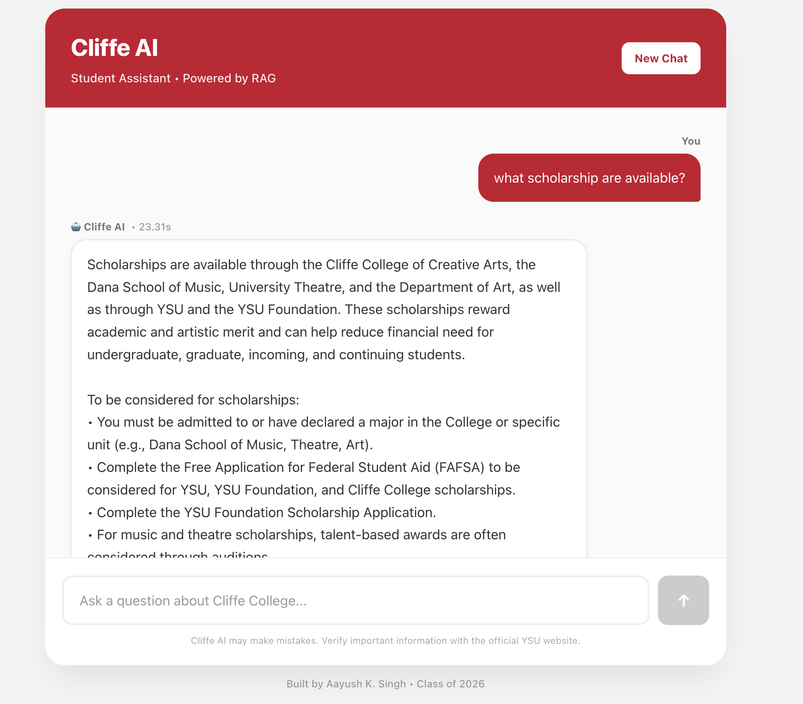

# Cliffe AI 🤖

Cliffe AI is a Retrieval-Augmented Generation (RAG) chatbot built for the **Cliffe College of Creative Arts at Youngstown State University**.

It helps prospective and current students quickly find information about programs, faculty, leadership, scholarships, events, departments, and other content published on the Cliffe College website.

Instead of answering from general AI knowledge, Cliffe AI retrieves relevant information directly from content collected from:

`https://academics.ysu.edu`

and uses that context to generate its response.

> **Status:** Live and publicly deployed.  
> **Live app:** https://cliffe-college-assistant-teur-seven.vercel.app/



---

## Live Demo

Try Cliffe AI here:

**https://cliffe-college-assistant-teur-seven.vercel.app/**

---

## Why I Built This

University websites contain a large amount of useful information, but finding one specific answer can require navigating through many pages.

Cliffe AI provides a focused assistant for questions such as:

- Who is a specific faculty or staff member?
- What scholarships are available?
- What programs does the Dana School of Music offer?
- Who leads a department?
- What opportunities are available in Theatre or Art?
- What information is available about the McDonough Museum of Art?

The goal is to provide a faster way to search the Cliffe College ecosystem while still grounding answers in official YSU website content.

---

## Architecture

Cliffe AI uses **hybrid retrieval**, combining semantic vector search with traditional keyword search.

```text
                         ┌──────────────────────┐
                         │   YSU Cliffe Website │
                         │  academics.ysu.edu   │
                         └──────────┬───────────┘
                                    │
                              crawl + extract
                                    │
                                    ▼
                         ┌──────────────────────┐
                         │ Section-aware chunks │
                         │ + metadata + sources │
                         └──────────┬───────────┘
                                    │
                       offline indexing / corpus
                                    │
                    ┌───────────────┴───────────────┐
                    ▼                               ▼
          ┌──────────────────┐           ┌──────────────────┐
          │ Pinecone Vectors │           │ Local BM25 Index │
          │ Semantic Search  │           │ Keyword Search   │
          └────────┬─────────┘           └────────┬─────────┘
                   │                              │
                   └──────────────┬───────────────┘
                                  ▼
                         ┌──────────────────┐
                         │   RRF Fusion     │
                         │ + exact matching │
                         │ + diversification│
                         └────────┬─────────┘
                                  │
                            best 7 chunks
                                  │
                                  ▼
                         ┌──────────────────┐
                         │ Gemini 2.5 Flash │
                         │ Answer Generation│
                         └────────┬─────────┘
                                  │
                                  ▼
┌─────────────┐    POST /ask    ┌──────────────────┐
│  Next.js UI │ ──────────────► │ FastAPI Backend  │
│             │ ◄────────────── │                  │
└─────────────┘      answer     └──────────────────┘
```

The current production version also supports short conversational follow-ups such as:

```text
Who is Samantha Nan-Callahan?
Can I have her email?
What is her phone number?
```

The backend carries forward the most recent topic so pronouns such as `her`, `him`, and `it` can be resolved without searching the entire conversation.

---

## Retrieval Pipeline

The current V3 system does not rely only on vector similarity.

For every question, Cliffe AI performs two searches.

### 1. Semantic Search

The question is embedded using Pinecone's:

```text
llama-text-embed-v2
```

The query embedding is compared against the Cliffe document vectors stored in Pinecone.

### 2. BM25 Keyword Search

The same question is searched against the local Cliffe corpus using BM25.

This is especially useful for:

- faculty names
- staff names
- scholarships
- program names
- exact terminology
- department names

### 3. Reciprocal Rank Fusion

The semantic and BM25 rankings are combined using **Reciprocal Rank Fusion (RRF)**.

Additional generic ranking improvements include:

- exact query-term coverage
- multi-word phrase matching
- source diversification
- limiting repeated chunks from the same page
- recent-topic carry-forward for conversational follow-ups
- relevance filtering for source cards

The final **7 highest-quality chunks** are passed to Gemini.

---

## Data Ingestion

The ingestion pipeline is handled by `backend/ingest.py`.

It:

1. Connects to YSU's Drupal JSON:API.
2. Automatically discovers available Drupal node content types.
3. Filters content to the Cliffe College ecosystem.
4. Recursively follows relevant internal links.
5. Extracts useful main content from each page.
6. Removes navigation and irrelevant page content.
7. Preserves headings, lists, staff information, and document structure.
8. Canonicalizes URLs and removes duplicate content.
9. Splits documents using section-aware chunking.
10. Stores metadata including page title, section, unit, and source URL.
11. Saves the final corpus locally for hybrid retrieval.

The current corpus contains approximately:

```text
938 useful pages
5,492 retrieval chunks
```

Content includes:

- Cliffe College of Creative Arts
- Dana School of Music
- Department of Art
- University Theatre
- McDonough Museum of Art
- Percussion program content

---

## Embedding and Indexing

Document embedding is separated from website crawling.

After the corpus has been generated, run:

```bash
python reindex_pinecone_free.py
```

The script embeds the chunks using:

```text
Pinecone llama-text-embed-v2
```

and stores them in:

```text
Index:     cliffe-bot-v3
Namespace: cliffe-v3
Dimension: 1024
Metric:    cosine
```

The script is resumable. If Pinecone's free-tier rate limit is reached, it waits and continues. Existing vectors are skipped instead of being uploaded again.

---

## Tech Stack

The project is designed to operate using free tiers for normal development and demo usage.

| Layer | Technology |
|---|---|
| Frontend | Next.js / React |
| Backend | FastAPI |
| Vector Database | Pinecone |
| Dense Embeddings | Pinecone `llama-text-embed-v2` |
| Keyword Retrieval | BM25 |
| Hybrid Ranking | Reciprocal Rank Fusion |
| Generation | Google Gemini `2.5-flash` |
| Frontend Hosting | Vercel |
| Backend Hosting | Render |

There is **no OpenAI dependency** in the application.

The production backend also does not require Hugging Face hosted inference or LangChain.

> Free-tier quotas and limits are controlled by the individual providers and may change over time.

---

## Project Structure

```text
cliffe-rag/
│
├── backend/
│   ├── main.py
│   │   # FastAPI API + hybrid retrieval + Gemini generation
│   │
│   ├── ingest.py
│   │   # Crawls and processes the YSU Cliffe website
│   │
│   ├── reindex_pinecone_free.py
│   │   # Embeds the generated corpus and uploads it to Pinecone
│   │
│   ├── requirements.txt
│   │   # Lightweight production dependencies
│   │
│   ├── requirements-ingest.txt
│   │   # Additional dependencies used for ingestion
│   │
│   └── data/
│       ├── cliffe_v2_corpus.json.gz
│       │   # Hybrid-search corpus
│       │
│       └── cliffe_v2_crawl_report.json
│           # Crawl statistics and diagnostics
│
├── frontend/
│   ├── app/
│   │   ├── page.tsx
│   │   │   # Chat interface
│   │   └── layout.tsx
│   │
│   └── package.json
│
└── README.md
```

---

## Setup

### 1. Clone the Repository

```bash
git clone https://github.com/singhaayush01/cliffe-college-assistant.git
cd cliffe-college-assistant
```

---

## Backend

Move into the backend:

```bash
cd backend
```

Create a virtual environment:

```bash
python3 -m venv venv
```

Activate it.

### macOS / Linux

```bash
source venv/bin/activate
```

### Windows

```bash
venv\Scripts\activate
```

Install production dependencies:

```bash
python -m pip install -r requirements.txt
```

---

## Environment Variables

Create:

```text
backend/.env
```

Add:

```env
GOOGLE_API_KEY=your_google_gemini_api_key
PINECONE_API_KEY=your_pinecone_api_key
```

Do not commit `.env`.

You can obtain API keys from:

- Google AI Studio: `https://aistudio.google.com/apikey`
- Pinecone: `https://app.pinecone.io`

---

## Build / Refresh the Knowledge Base

Install the ingestion dependencies if necessary:

```bash
python -m pip install -r requirements-ingest.txt
```

Run the crawler:

```bash
python ingest.py
```

By default this performs an audit and builds:

```text
backend/data/cliffe_v2_corpus.json.gz
backend/data/cliffe_v2_crawl_report.json
```

Then build or refresh the Pinecone V3 index:

```bash
python reindex_pinecone_free.py
```

The reindex script is resumable, so an interrupted indexing run can safely be started again.

---

## Start the Backend

```bash
python -m uvicorn main:app --reload
```

Backend:

```text
http://127.0.0.1:8000
```

Interactive FastAPI documentation:

```text
http://127.0.0.1:8000/docs
```

Example request:

```json
{
  "question": "Who is Samantha?",
  "history": []
}
```

Example response structure:

```json
{
  "answer": "...",
  "sources": [
    "https://academics.ysu.edu/..."
  ],
  "response_time": 1.42
}
```

---

## Frontend

Open another terminal:

```bash
cd frontend
npm install
npm run dev
```

Local frontend:

```text
http://localhost:3000
```

Live frontend:

```text
https://cliffe-college-assistant-teur-seven.vercel.app/
```

The frontend sends questions and recent conversation context to:

```text
POST /ask
```

on the FastAPI backend.

---

## Example Questions

Cliffe AI can answer questions such as:

```text
Who is Samantha?

Who is Samantha Nan-Callahan?

Can I have her email?

Who is Phyllis Paul?

What scholarships are available?

What programs are offered by the Dana School of Music?

Tell me about the McDonough Museum of Art.

What programs does University Theatre offer?
```

---

## API

### Health Check

```http
GET /
```

Example:

```json
{
  "status": "ok",
  "service": "Cliffe AI",
  "rag_version": "v3.2-conversational-hybrid",
  "index": "cliffe-bot-v3",
  "namespace": "cliffe-v3",
  "embedding_model": "llama-text-embed-v2"
}
```

### Ask a Question

```http
POST /ask
```

Request:

```json
{
  "question": "What scholarships are available?",
  "history": []
}
```

The backend performs:

```text
Question
   │
   ├────► Pinecone semantic search ────┐
   │                                    │
   └────► BM25 keyword search ─────────┤
                                        ▼
                                   RRF fusion
                                        │
                               exact-term boosting
                                        │
                              source diversification
                                        │
                                  top 7 chunks
                                        │
                                  Gemini 2.5
                                        │
                                      answer
```

For conversational follow-ups, the backend also carries forward the most recent user topic so short questions remain grounded in the correct subject.

---

## Updating Website Content

When the YSU website changes, refresh the corpus with:

```bash
python ingest.py
```

Review the generated crawl report.

Then update the vector database:

```bash
python reindex_pinecone_free.py
```

The indexing script automatically skips vectors that already exist.

If the chunk IDs change because the page content changed, the new chunks will be embedded and uploaded.

---

## Retrieval Design

One important design goal of Cliffe AI is avoiding query-specific hacks.

The retriever does **not** contain special rules such as:

```text
if question contains "Samantha":
    return Samantha's page
```

Instead, the same retrieval pipeline works for:

- people
- programs
- scholarships
- events
- departments
- facilities
- general questions
- conversational follow-ups

This makes the system more scalable and more representative of a real RAG architecture.

---

## Current Version

### Cliffe AI V3.2

Current features:

- Focused recursive YSU crawler
- Automatic Drupal content-type discovery
- Main-content extraction
- URL canonicalization
- Duplicate-content removal
- Section-aware chunking
- Metadata-rich documents
- Pinecone semantic retrieval
- BM25 lexical retrieval
- Reciprocal Rank Fusion
- Generic exact-term boosting
- Source diversification
- Conversational follow-up context
- Relevance-filtered source cards
- Gemini grounded answer generation
- Source URLs returned by the API
- Chat-style Next.js frontend
- Lazy backend initialization
- Resumable indexing
- Free-tier-oriented architecture
- Public Vercel deployment

---

## Roadmap

- [x] Focused Cliffe website crawler
- [x] Section-aware chunking
- [x] Pinecone vector search
- [x] BM25 keyword retrieval
- [x] Hybrid RRF ranking
- [x] Gemini answer generation
- [x] Conversational chat interface
- [x] Conversational follow-up context
- [x] Source cards in the frontend
- [x] Free-tier embedding architecture
- [x] Resumable indexing
- [x] Public V3 deployment
- [ ] Automated scheduled website refresh
- [ ] Retrieval evaluation suite

---

## Deployment

Cliffe AI is currently deployed with:

- **Frontend:** Vercel
- **Backend:** Render
- **Vector database and embeddings:** Pinecone
- **Generation:** Google Gemini

### Live App

**https://cliffe-college-assistant-teur-seven.vercel.app/**

---

## Author

**Aayush K. Singh**  
Class of 2026

Built as a full-stack AI/RAG project using real university web content.
